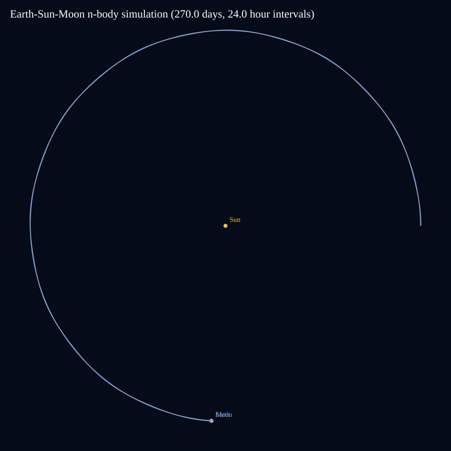
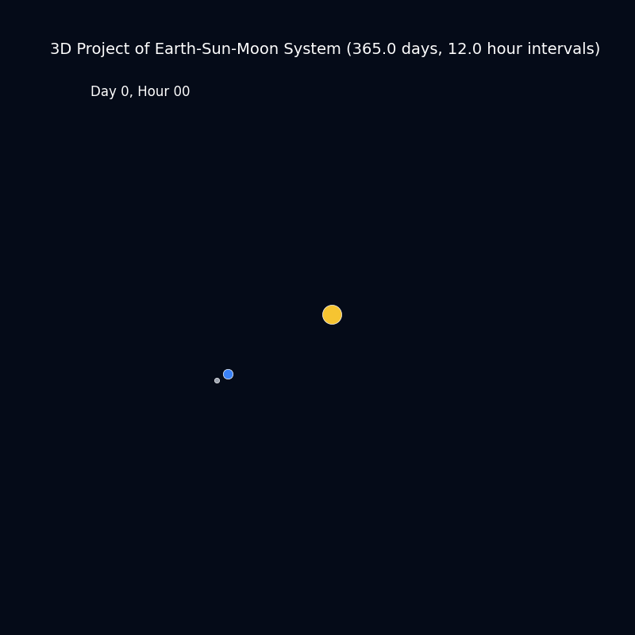
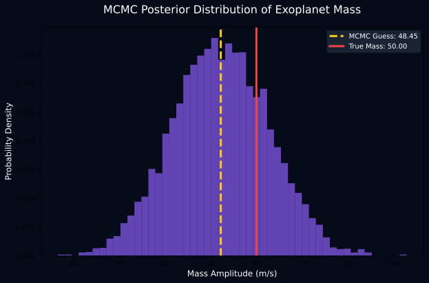

# UniverseLab

UniverseLab is a small astrophysics sandbox that combines numerical simulation, visualization, and Bayesian inference. The current focus is on two completed threads:

1. A three-body Sun-Earth-Moon gravity simulation with a leapfrog integrator.
2. A synthetic exoplanet radial-velocity example solved with Metropolis-Hastings MCMC.

## What’s Included

### Gravity simulation

The `gravity/` folder contains the Sun-Earth-Moon n-body model, a leapfrog integration lesson, and a renderer that exports both a static orbit plot and a single animated preview.

Key files:

- `gravity/earth_sun_moon_simulation.py` generates trajectories and the static SVG output.
- `gravity/animate_simulation.py` renders the three-body animation.
- `gravity/leapfrog_integration_lesson.md` explains why leapfrog is more stable than forward Euler.
- `gravity/test_earth_sun_moon_simulation.py` covers the simulation behavior.

### Exoplanet inference

The `machine_learning/` folder contains a short lesson and script that generate noisy synthetic radial-velocity data, run Metropolis-Hastings sampling, and plot the posterior distribution for a hidden planet signal.

Key files:

- `machine_learning/mcmc_exoplanet.py` generates synthetic data and runs the sampler.
- `machine_learning/mcmc_exoplanet_lesson.md` explains the Bayesian fitting workflow.

## Run the Projects

### Earth, Moon, and Sun

```bash
python gravity/earth_sun_moon_simulation.py
python gravity/animate_simulation.py
```

Outputs:

- `datasets/earth_sun_moon_trajectories.csv`
- `visualizations/earth_sun_moon_simulation.svg`
- `visualizations/earth_sun_moon_3d.gif`

### Exoplanet MCMC example

```bash
python machine_learning/mcmc_exoplanet.py
```

Outputs:

- `datasets/synthetic_exoplanet_rv.csv`
- `visualizations/mcmc_posterior.svg`

## Sample Visualizations

### Earth-Sun-Moon orbit plot



### Earth-Sun-Moon animation



### Exoplanet posterior distribution



## Repository Layout

- `gravity/` numerical integration, 3-body dynamics, and simulation lessons
- `machine_learning/` MCMC parameter fitting example and lesson
- `datasets/` generated CSV outputs
- `visualizations/` generated plots and animations
- `stars/` placeholder for future stellar modeling work
- `galaxies/` placeholder for future galaxy-scale experiments
- `blackholes/` placeholder for future compact-object work
- `cosmology/` placeholder for future cosmology work
- `physics/` placeholder for general physics experiments
- `experiments/` scratch space for exploratory work

## Notes

- The gravity simulation uses leapfrog integration so the orbit stays stable over longer runs.
- The animation intentionally shows only one animated 3-body visualization, as requested.
- The example outputs in `visualizations/` are generated artifacts and can be recreated by rerunning the scripts above.
